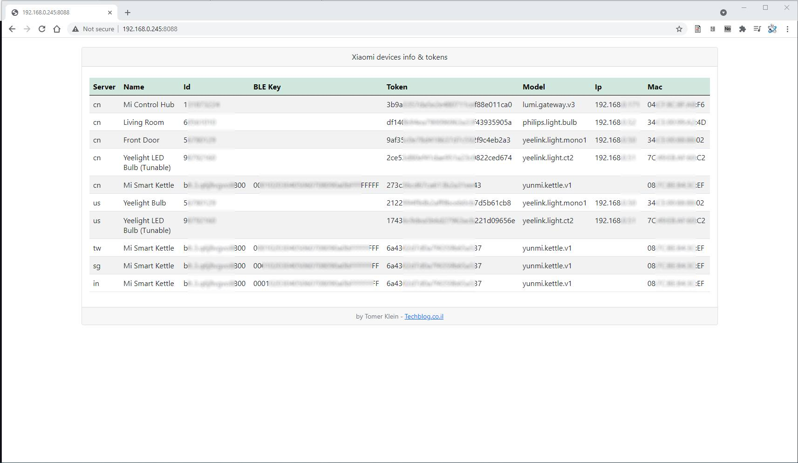
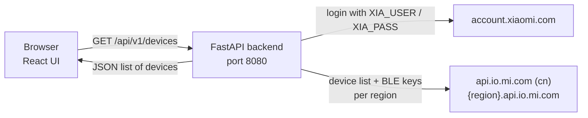

*Please :star: this repo if you find it useful*

# Xiaomi Token Extractor

[](https://github.com/t0mer/Xiaomi-Token-Extractor/actions/workflows/docker.yml)
[](https://hub.docker.com/r/techblog/xiaomi_token_extractor)
[](License)

Xiaomi Token Extractor is a self-hosted web app. It signs in to your Xiaomi Cloud account and lists
every device linked to it, with its **device token**, **BLE key**, model, IP and MAC address. Home
Assistant (Xiaomi Miio integration), `python-miio` and similar tools need these tokens to control
Xiaomi devices over your local network.

The app runs as a single Docker container: a **FastAPI** backend talks to Xiaomi Cloud, and it also
serves a **React + Vite + TypeScript + Tailwind** web UI.

> **Disclaimer:** this project is not affiliated with, endorsed by or supported by Xiaomi. It uses
> unofficial, undocumented Xiaomi Cloud APIs that can change or stop working at any time. Use it at
> your own risk.

## Table of contents

- [Features](#features)
- [Screenshot](#screenshot)
- [How it works](#how-it-works)
- [Requirements](#requirements)
- [Installation](#installation)
- [Configuration](#configuration)
- [Usage](#usage)
- [API reference](#api-reference)
- [Troubleshooting](#troubleshooting)
- [Security notes](#security-notes)
- [Development](#development)
- [Contributing](#contributing)
- [Credits](#credits)
- [License](#license)

## Features

- Fetches devices from every Xiaomi Cloud region (`cn`, `de`, `us`, `ru`, `tw`, `sg`, `in`, `i2`),
  or from a single region if you set `XIA_SRV`.
- Shows server, name, device ID, BLE key, token, model, local IP and MAC for each device.
- Fetches the BLE key (beacon key) for Bluetooth devices (device IDs containing `blt`).
- One-click copy for the token and BLE key values, with a fallback that also works over plain HTTP.
- Instant search across all device fields.
- Dark / light mode toggle. Dark is the default, and your choice is kept in the browser.
- Responsive layout: a full table on desktop, cards on mobile.
- JSON REST API (`GET /api/v1/devices`) with interactive Swagger docs at `/api/docs`.
- `/health` endpoint, used by the container's `HEALTHCHECK`.
- Multi-arch Docker image (`linux/amd64`, `linux/arm64`) that runs as a non-root user.

## Screenshot

<!-- TODO: screenshot — the image below shows the previous Flask/Bootstrap UI, not the current React UI -->



## How it works



1. When you open the page, the UI calls `GET /api/v1/devices`.
2. The backend signs in to Xiaomi Cloud with the credentials from the environment
   (`XIA_USER` / `XIA_PASS`). It does this again on **every** request; nothing is cached.
3. For each region (all eight, or only `XIA_SRV`), it requests the device list. For Bluetooth
   devices it also requests the BLE key.
4. The combined list is returned as JSON and shown in the UI.

The Xiaomi Cloud client (`xiasrv/XiaomiCloudConnector.py`) is based on
[PiotrMachowski/Xiaomi-cloud-tokens-extractor](https://github.com/PiotrMachowski/Xiaomi-cloud-tokens-extractor).
See [Credits](#credits).

## Requirements

- A Xiaomi account (the one you use in the Mi Home / Xiaomi Home app) with devices linked to it.
- Outbound HTTPS access to `account.xiaomi.com`, `api.io.mi.com` and `*.api.io.mi.com`.
- **Docker** (with Docker Compose), on `linux/amd64` or `linux/arm64`, **or** for running from
  source: Python 3.12 and Node.js 24 (the versions the Dockerfile uses).
- Accounts that need two-factor verification at login are not supported; the login code does not
  handle it.

## Installation

### Docker Compose

Create a `docker-compose.yaml` (or use the one in this repository) and fill in your credentials:

```yaml
services:
  xiaomi_token_extractor:
    image: techblog/xiaomi_token_extractor:latest
    container_name: xiaomi_token_extractor
    restart: always
    environment:
      - XIA_USER=your@email.com
      - XIA_PASS=yourpassword
      - XIA_SRV=          # optional: cn, de, us, ru, tw, sg, in, i2
    ports:
      - "8080:8080"
```

```bash
docker compose up -d
```

Open `http://<host>:8080` in your browser.

The repository's `docker-compose.yaml` also sets the label `com.ouroboros.enable=true`. It is only
used by the [Ouroboros](https://github.com/pyouroboros/ouroboros) auto-updater and can be removed if
you don't use it.

### Docker run

```bash
docker run -d \
  --name xiaomi_token_extractor \
  -e XIA_USER=your@email.com \
  -e XIA_PASS=yourpassword \
  -p 8080:8080 \
  techblog/xiaomi_token_extractor:latest
```

Because you usually only need the tokens once, you can also run it just for as long as you need it:
replace `-d` with `--rm -it`, copy your tokens, and stop it with `Ctrl+C`.

### Image tags

Images are published to Docker Hub as
[`techblog/xiaomi_token_extractor`](https://hub.docker.com/r/techblog/xiaomi_token_extractor):

| Tag | What it is | Platforms |
|---|---|---|
| `latest` | Current FastAPI + React version | `linux/amd64`, `linux/arm64` |
| `1.3.0` | Currently the same image as `latest` (see note below) | `linux/amd64`, `linux/arm64` |
| `1.5.0` | Older build (2024) | `linux/amd64`, `linux/arm64` |
| `1.0.0` – `1.2.1` | Legacy Flask versions (2021) | `linux/amd64`, `linux/arm64`, `linux/arm/v7` |
| `arm` | Legacy build (2021-06-09) | `linux/arm` |

Use `latest`. The Docker workflow names the version tag with `git describe --tags --abbrev=0` (the
nearest tag reachable from the built commit; it falls back to `VERSION` only when the repository has no
tags), so the current build (`VERSION` 2.0.0) was pushed as `1.3.0`. <!-- TODO: verify — retag once a 2.x release/tag exists -->
There is no current image for 32-bit ARM (`linux/arm/v7`).

### From source

The backend serves the built frontend from `xiasrv/static/`, so build the frontend first.

```bash
git clone https://github.com/t0mer/Xiaomi-Token-Extractor.git
cd Xiaomi-Token-Extractor

# 1. Frontend (Node.js 24) — writes the build to xiasrv/static/
cd web
npm ci
npm run build
cd ..

# 2. Backend (Python 3.12) — run it from the xiasrv/ directory
cd xiasrv
python3 -m venv .venv
. .venv/bin/activate
pip install -r requirements.txt
XIA_USER=your@email.com XIA_PASS=yourpassword \
  uvicorn app.main:app --host 0.0.0.0 --port 8080
```

Run `uvicorn` from inside `xiasrv/`, because the app imports `XiaomiCloudConnector` from that
directory. If `xiasrv/static/` does not exist, only the API is served.

## Configuration

All settings come from environment variables (read with `pydantic-settings`; names are not case
sensitive). There are no CLI flags and no config file.

| Variable | Default | Description |
|---|---|---|
| `XIA_USER` | *(empty)* | Xiaomi account login (email or Xiaomi account ID). Required. |
| `XIA_PASS` | *(empty)* | Xiaomi account password. Required. |
| `XIA_SRV` | *(empty)* | Only query this region: `cn`, `de`, `us`, `ru`, `tw`, `sg`, `in` or `i2`. Empty means all eight regions. |
| `LOG_LEVEL` | `info` | Defined in the settings and the Dockerfile, but not used by the app. |

The container listens on port **8080** (fixed in the Dockerfile `CMD`). To use another host port,
change the port mapping, for example `-p 8088:8080`.

## Usage

### Web UI

1. Open `http://<host>:8080`. The page signs in to Xiaomi Cloud and loads your devices. With all
   regions enabled this can take a while, because each region is queried in turn.
2. Use the search box to filter by any field (name, model, IP, MAC, region, …).
3. Click the copy icon next to a **Token** or **BLE Key** to copy the full value. The UI shows only
   the first 8 characters.
4. Toggle dark / light mode with the button in the top bar.
5. Reload the page to fetch the list again.

If the login or the cloud request fails, the error message from the API is shown instead of the
list.

### Using the tokens

- **Token**: the device token that Home Assistant's Xiaomi Miio integration,
  `python-miio` and similar local-control tools ask for.
- **BLE Key**: the beacon key of a Bluetooth device, shown only for devices whose ID contains `blt`.
- A device can appear more than once if it is linked in more than one region.

## API reference

Interactive docs are served at `/api/docs` (Swagger UI) and `/redoc` (ReDoc), and the OpenAPI schema
at `/openapi.json`.
The API has no authentication (see [Security notes](#security-notes)).

| Method | Path | Description |
|---|---|---|
| `GET` | `/health` | Liveness check: `{"status": "ok", "version": "…"}` |
| `GET` | `/api/v1/devices` | Signs in to Xiaomi Cloud and returns all devices |
| `GET` | `/api/docs` | Swagger UI |
| `GET` | `/redoc` | ReDoc |
| `GET` | `/openapi.json` | OpenAPI schema |

Credentials are **not** sent in the request; the backend always uses `XIA_USER` / `XIA_PASS` from
its environment.

```bash
curl http://localhost:8080/health
curl http://localhost:8080/api/v1/devices
```

Example response of `GET /api/v1/devices` (values are placeholders):

```json
[
  {
    "server": "de",
    "name": "Living Room Lamp",
    "id": "123456789",
    "ble_key": "",
    "token": "<device token>",
    "model": "yeelink.light.ct2",
    "ip": "192.168.1.50",
    "mac": "AA:BB:CC:DD:EE:FF"
  }
]
```

| Status | Meaning |
|---|---|
| `200` | List of devices (can be empty) |
| `500` | `{"detail": "Login failed — check XIA_USER and XIA_PASS"}` |
| `503` | Another error while talking to Xiaomi Cloud; `detail` holds the error message |

## Troubleshooting

- **"Login failed — check XIA_USER and XIA_PASS"**: the sign-in did not complete. The container log
  shows which step failed: `Invalid username.`, `Invalid login or password.` or
  `Unable to get service token.` Check the credentials. Accounts that require extra verification
  (two-factor, captcha) at login cannot sign in, because the login code does not handle it.
- **HTTP 503 with an error message**: a network or parsing error while talking to Xiaomi Cloud.
  Check that the host can reach `account.xiaomi.com`, `api.io.mi.com` and `*.api.io.mi.com`. A region
  that cannot be reached at all (a connection error) fails the whole request with this error.
- **The device list is empty or a device is missing**: the device may be linked in another region.
  Clear `XIA_SRV` to query all regions. A region that answers with a non-200 HTTP status is skipped
  and logged as `No response from server <region>`.
- **Slow loading or a request that never finishes**: every page load signs in again and queries each
  region one after another. The requests to Xiaomi have no timeout, so a region that hangs stalls the
  whole request. Set `XIA_SRV` to your region to speed it up.
- **`/health` reports `"version": "dev"` in the container**: the `VERSION` file is not copied into the
  image, so the version falls back to `dev`. This does not affect the app.

## Security notes

- You give the app your **Xiaomi account credentials**. They are read from environment variables and
  held in memory only; the app does not write them to disk, and does not log them in normal
  operation. However, if the login request fails with a network error, the exception message is
  logged and also returned in the 503 `detail`. That message includes the request URL, which carries
  the username and the MD5 hash of the password as query parameters. Anyone who can read the
  container's configuration (for example with `docker inspect`) can see them.
- The web UI and the API have **no authentication**. Anyone who can reach the port can read every
  device token. Run the app locally or on a trusted network only, and never expose it to the
  internet. Keep it local, or put it behind HTTPS and an authenticating reverse proxy.
- **Device tokens give local control of your devices.** Treat them like passwords, and don't share
  them or post screenshots of them.
- Consider running the container only while you need the tokens, and stopping it afterwards.

## Development

### Project layout

```
.
├── xiasrv/                      # Backend (FastAPI, Python 3.12)
│   ├── app/
│   │   ├── main.py              # FastAPI app, /health, static file serving
│   │   ├── api/v1/devices.py    # GET /api/v1/devices
│   │   └── core/config.py       # Settings (environment variables)
│   ├── XiaomiCloudConnector.py  # Xiaomi Cloud client (from PiotrMachowski/Xiaomi-cloud-tokens-extractor)
│   ├── tests/test_api.py        # pytest tests
│   ├── requirements.txt
│   └── requirements-dev.txt
├── web/                         # Frontend (React, Vite, TypeScript, Tailwind)
│   └── src/                     # Components, theme context, Vitest tests
├── Dockerfile                   # Two stages: node:24-alpine build → python:3.12-slim runtime
├── docker-compose.yaml
├── VERSION
└── .github/workflows/           # Docker Hub and GHCR publishing
```

### Backend

```bash
cd xiasrv
pip install -r requirements.txt -r requirements-dev.txt
pytest
```

The tests mock `XiaomiCloudConnector`, so they never contact Xiaomi.

### Frontend

```bash
cd web
npm ci
npm run dev        # Vite dev server; proxies /api to http://localhost:8080
npm test           # Vitest (jsdom + Testing Library)
npm run test:watch
npm run lint       # ESLint
npm run build      # tsc -b && vite build → ../xiasrv/static
```

For live development, run the backend on port 8080 (see [From source](#from-source)) and
`npm run dev` in `web/` at the same time.

### Docker image

The `Dockerfile` has two stages. `node:24-alpine` builds the frontend, then `python:3.12-slim`
installs the backend, copies the built UI into `static/`, and runs `uvicorn` on port 8080 as the
non-root user `appuser` (UID 10001), with a `curl`-based `HEALTHCHECK` on `/health`.

```bash
docker build -t xiaomi_token_extractor .
```

### CI workflows

| Workflow | Trigger | Publishes |
|---|---|---|
| `docker.yml` (Docker) | Manual, or a published GitHub release | `techblog/xiaomi_token_extractor:latest` and `:<nearest git tag>` (`git describe --tags --abbrev=0`, falling back to `VERSION` when there are no tags) to Docker Hub, `linux/amd64` + `linux/arm64` |
| `publish-ghcr.yml` (Publish to GHCR) | Manual, with an optional tag input | `ghcr.io/t0mer/xiaomi_token_extractor:<tag>` and `:latest`, `linux/amd64` + `linux/arm64` + `linux/arm/v7`. It has not been run yet, so no GHCR image exists. |

No workflow runs the tests. The `.travis` file is a leftover from the original 2021 version and is
not used.

## Contributing

Issues and pull requests are welcome. Please run the backend tests (`pytest`) and the frontend tests
and lint (`npm test`, `npm run lint`) before opening a pull request.

## Credits

- The Xiaomi Cloud client in `xiasrv/XiaomiCloudConnector.py` is adapted from
  [PiotrMachowski/Xiaomi-cloud-tokens-extractor](https://github.com/PiotrMachowski/Xiaomi-cloud-tokens-extractor),
  Copyright (c) 2020 Piotr Machowski, licensed under the MIT License.
- Thanks to [tzungtzu](https://github.com/tzungtzu/Xiaomi-cloud-tokens-extractor) for the fork this
  project originally used.

## License

This project is licensed under the Apache License 2.0; see the [License](License) file. The
vendored Xiaomi Cloud client is MIT-licensed by its original author (see [Credits](#credits)).
